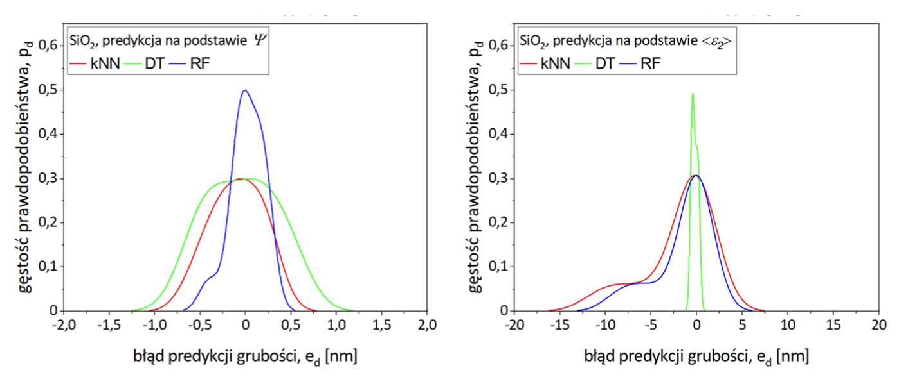

# Introduction

The aim of the project was to determine the effect of hyperparameters of machine learning algorithms on the accuracy of thin film thickness prediction from an ellipsometric dataset. Based on the literature analysis, three algorithms were selected for thin film thickness prediction: k-nearest neighbours, decision tree and random forest.

# Results

For each algorithm, a dedicated code was prepared to predict the thickness of silicon dioxide, silicon nitride, diamond-like carbon and zinc oxide thin films deposited on silicon substrates based on 13 ellipsometric data types. As part of the work, the hyperparameters of the various algorithms were optimised and the types of ellipsometric data for which the highest thin film thickness prediction accuracy was obtained were identified.

Prediction accuracy was evaluated based on statistical measures of the developed algorithms: coefficient of determination, mean squared error, mean absolute error and symmetric mean absolute percentage error. 

To analyze the prediction error, probability density plots were generated. It was observed that for the ψ parameter, regardless of the algorithm used, the plot follows a distribution closely resembling a normal distribution, indicating high prediction accuracy. In contrast, for the ε₂ parameter, the plot consists of two overlapping normal distributions.

For a more detailed analysis of the aforementioned parameters, spectral curve plots were examined. It was observed that for the ψ parameter, the dispersion curves do not intersect, whereas for the ε₂ parameter, they intersect over a wide range of wavelengths. This could have contributed to a higher prediction error, as the algorithm detected multiple possible layer thickness values for a single wavelength.

The highest prediction accuracy was achieved for the Ψ parameter using the random forest algorithm.
In total, the results of over 200,000 predictions were analyzed.
